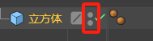
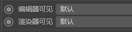
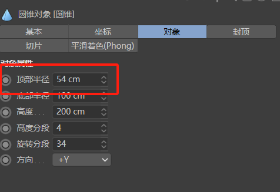
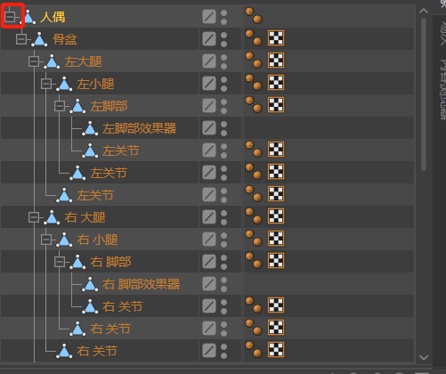

# C4D对象参数详讲

布线很有帮助

一：基本（立方体）

分离表面：开启之后按c键，每个边都分开了

渲染：按住alt键，同时开启和关闭

对应

显示颜色：进行标记

透显：可以观察内部结构

二：圆锥

要把对像里面的顶部半径调整，才能调封顶

三：球体

半球体封底-按住c模式-选择面模式-鼠标右键-封闭多边形孔洞

|

四：人偶

按住c键-ctrl键

空白对象

打组
