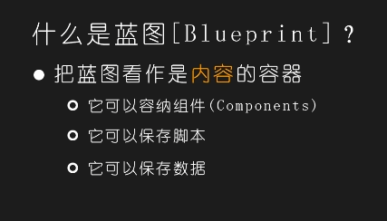

# 第一节：蓝图创建-变量-事件

变量：一个盒子,储存东西用的，方便使用，存进去或者拿出来。

变量：整数，布尔：判断对错的一个变量

ctrl+w复制事件图标

get获取  快捷键：ctrl

set设置  快捷键：alt

字节，整数，64区别：容纳数据范围的大小不一样。

变量：1.布尔

判断变量，真假

2.字节（比较小）（用的比较多）

数据变量，0-255的区间整数值

3.整数

比较大的数值

4.64（容纳比较大）

5.浮点

包含小数点

7.
