# 向量究竟是什么？

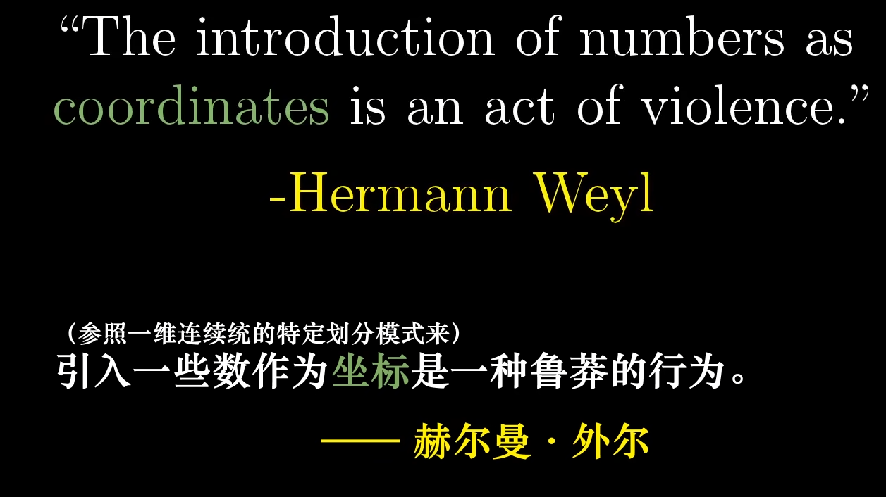

---

---

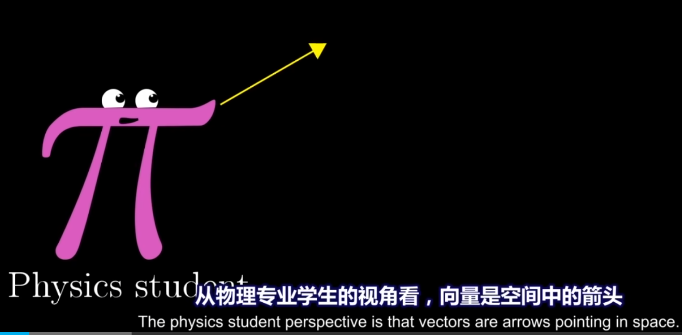

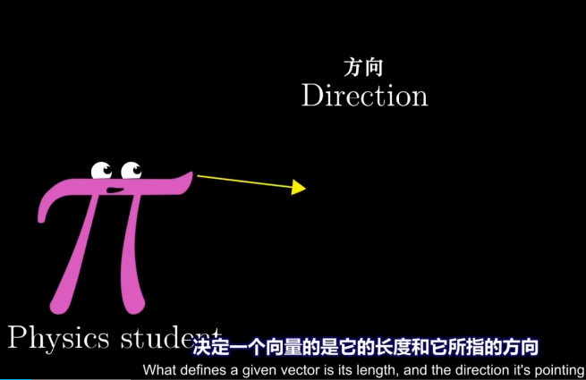

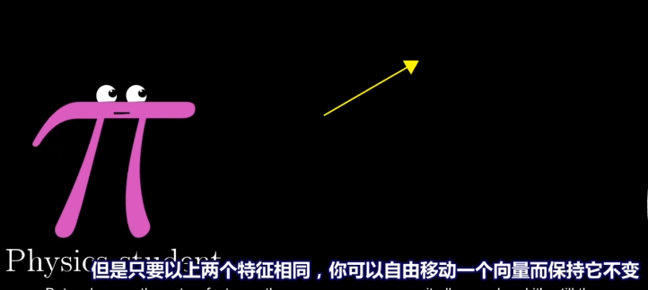

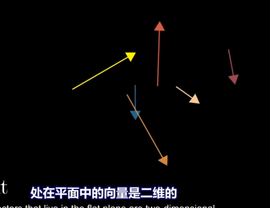

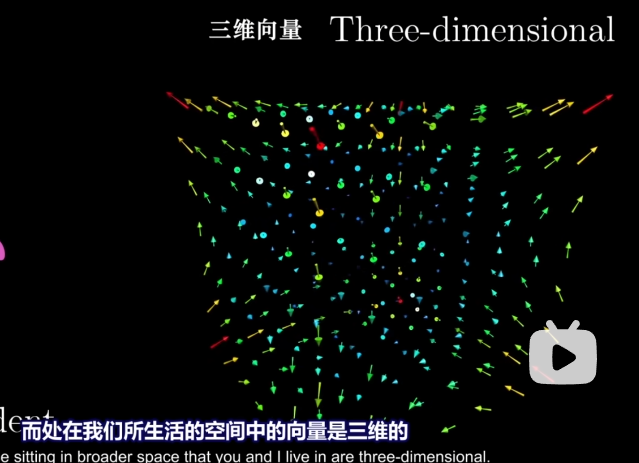

---

---

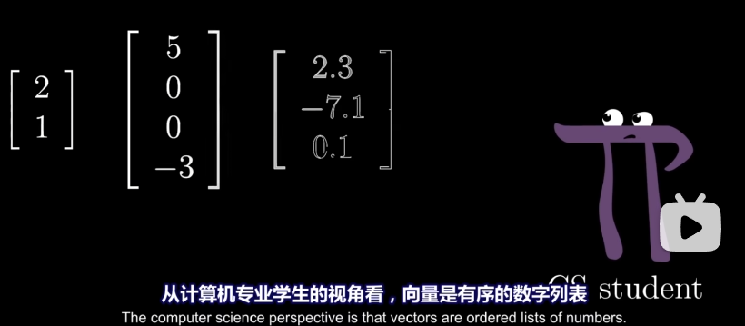

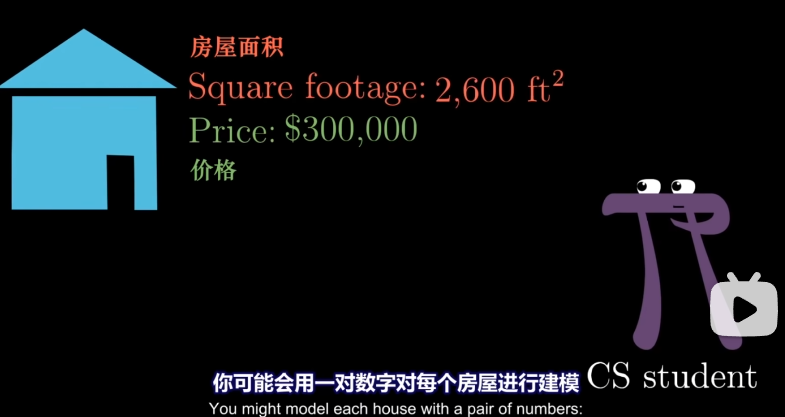

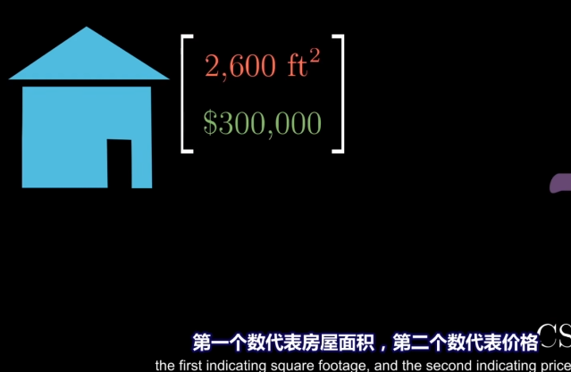

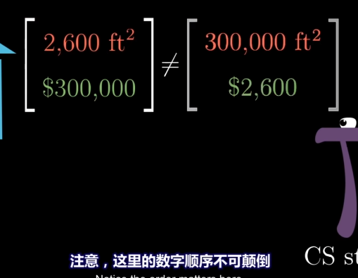

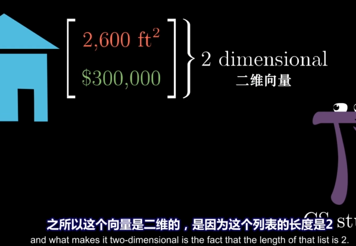

---

---

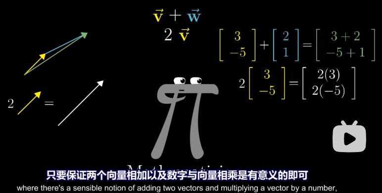

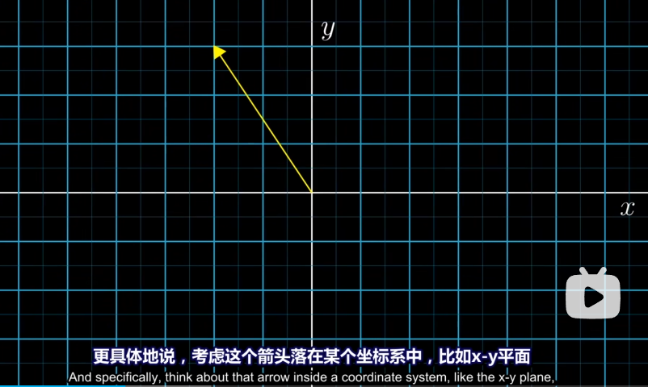

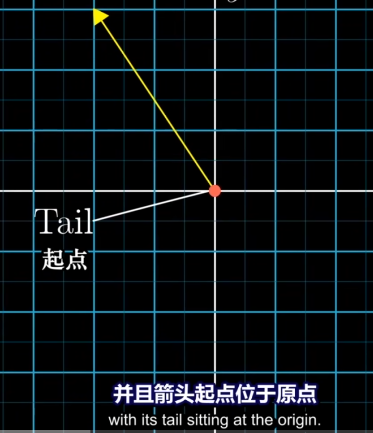

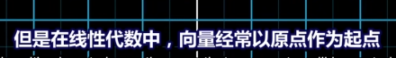

---

---

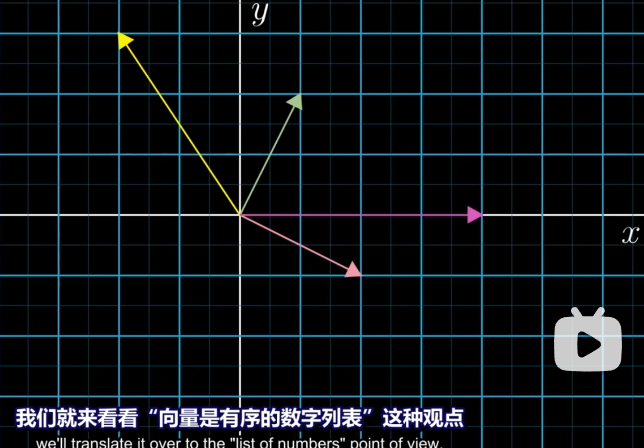

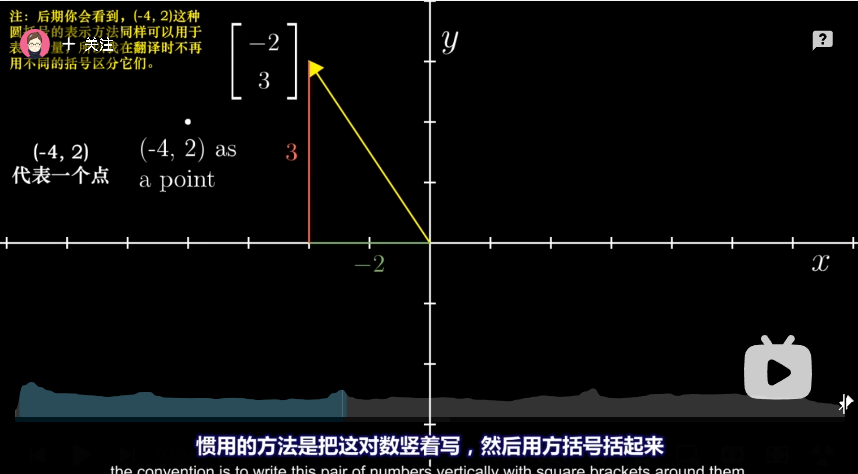

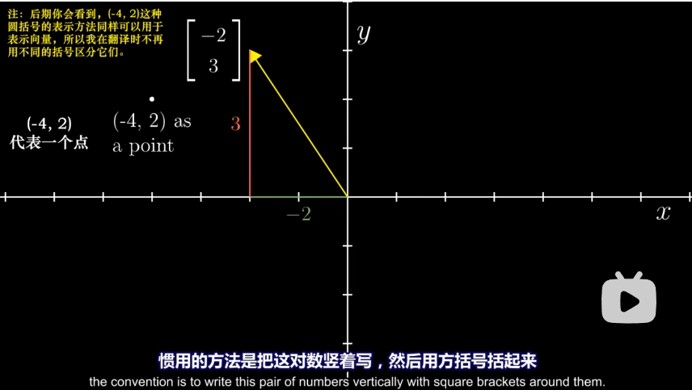

每一个数对应唯一的一个向量，向量长度就是从起点到终点x和y移动的位置

---

---

三维空间的向量又是什么样的？

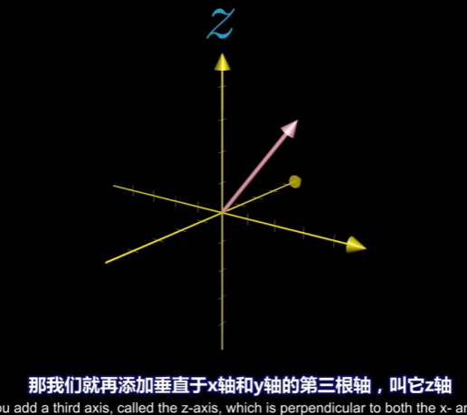

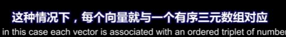

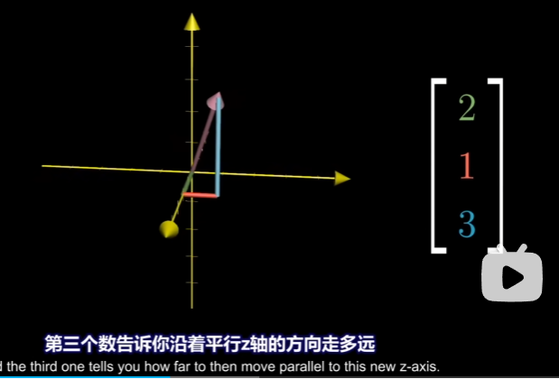

第一个数代表x走多远

第二个数代表y走多远

每一个三元数组对应唯一的一个向量，每一个向量对应唯一的一个三元数组

如何理解向量的加法：

假如有两个这样的向量，为了使他们相加，我们平移第w向量起点与v向量终点重合

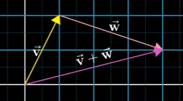

画一个向量，v向量与w向量起点与终点相重合，这个向量就是他们的和

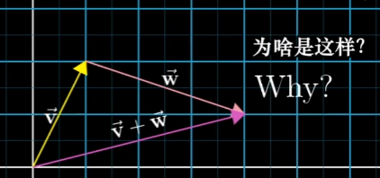

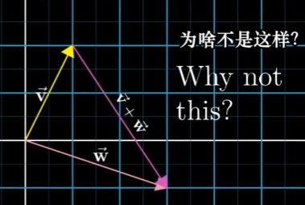

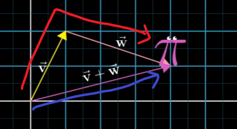

因为沿着v再沿着w移动与沿着v+w移动无异

和数学的加法很像，2+5，先走2步再走5步与直接走7步是无异的

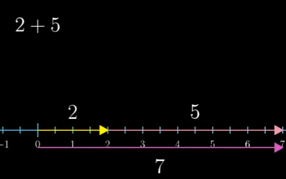

---

---

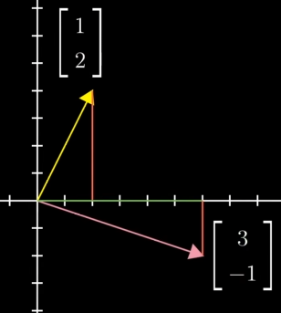

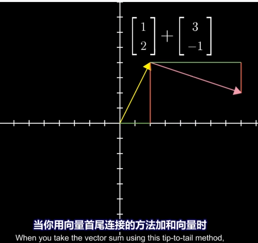

可以看作这样移动的

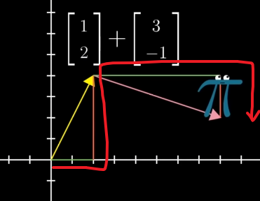

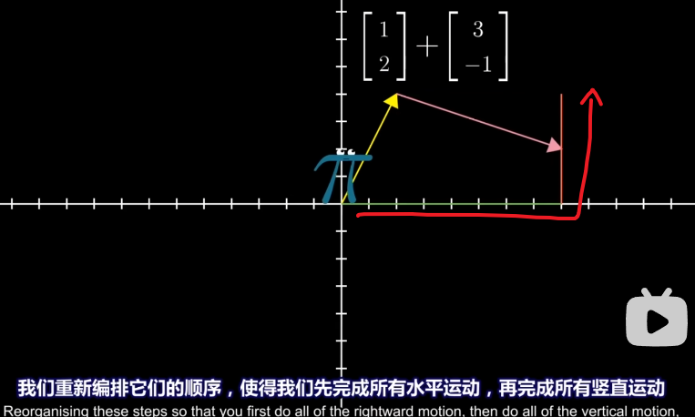

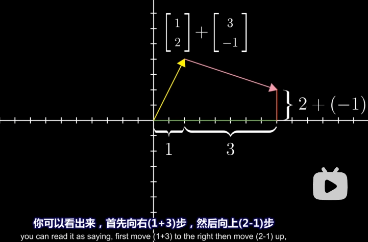

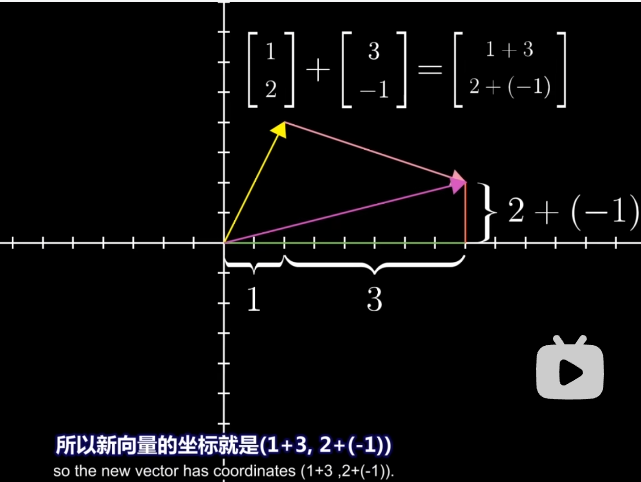

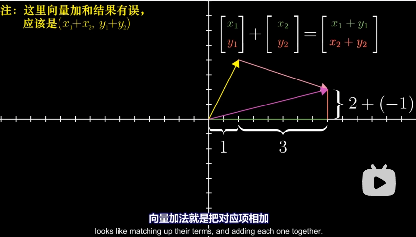

---

---

什么是向量的相乘？

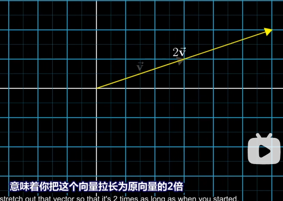

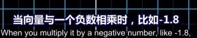

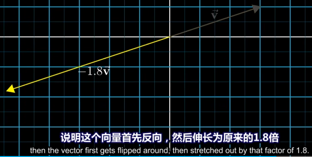

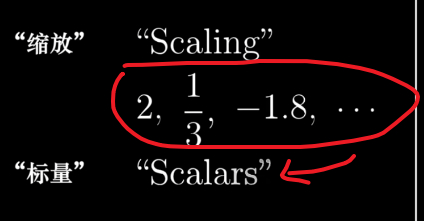

2，1/3，-1.8被称为标量

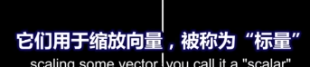

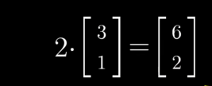

当把向量看作一个数字列表时：

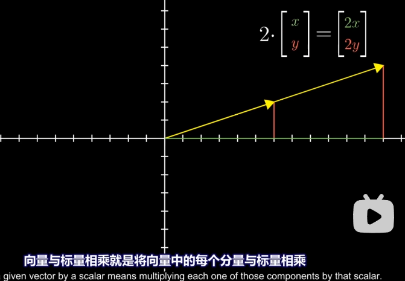

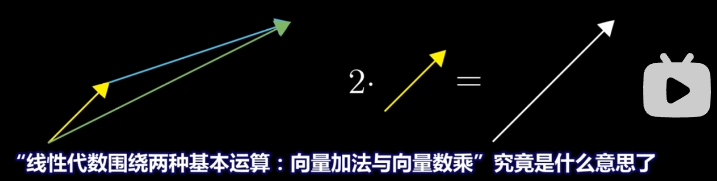

---

---

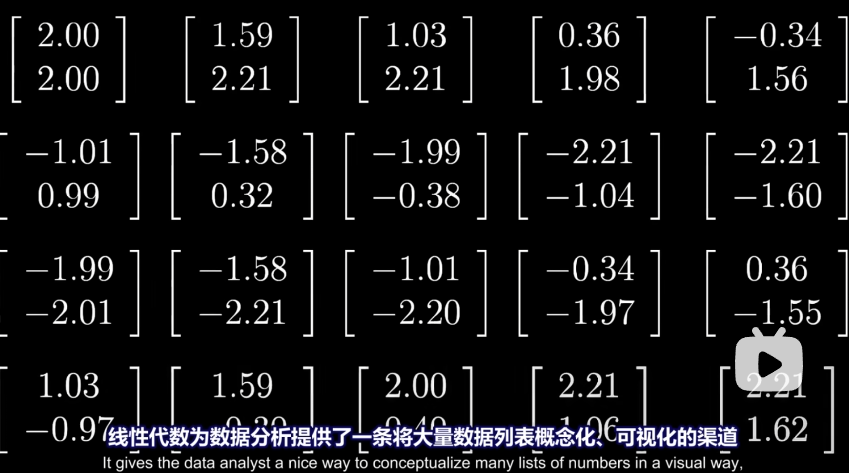

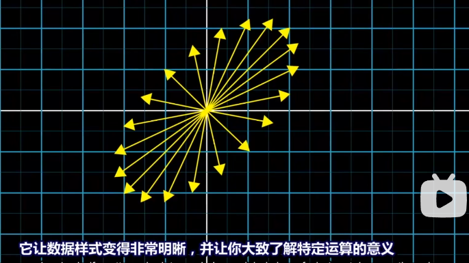

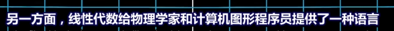

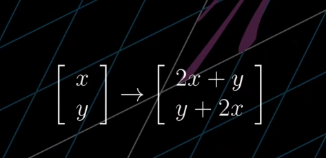

